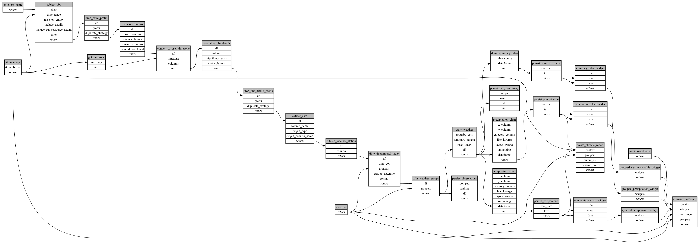

```
# AUTOGENERATED BY ECOSCOPE-WORKFLOWS; see fingerprint in README.md for details

```

```yaml
# fingerprint:
artifacts_sha256_basic: 68e8ee302bf658d29503a8c21f8869e2601193f0e27a35be143788597e28f847
artifacts_sha256_strict: 454b2a5df67a08bf0c798f11755509e39aea860534ef62c540a1a20a035dae33
installed_requirements:
- channel: https://repo.prefix.dev/ecoscope-workflows/
  name: ecoscope-workflows-core
  version: {version: ==0.22.13.dev22+g42a493731}
- channel: https://repo.prefix.dev/ecoscope-workflows/
  name: ecoscope-workflows-ext-ecoscope
  version: {version: ==0.22.14}
- channel: https://repo.prefix.dev/ecoscope-workflows-custom/
  name: ecoscope-workflows-ext-custom
  version: {version: ==0.0.32}
params_sha256: c7a76b901967dfa9aed040e27bc9edbcfae4660616248a99bcfcb9e3d8d5ace6
spec_sha256: 8e315ce47e48d8ebe1c0b9162d347a3760c4ab8885d5a7665b0cc44874ca4270

```

# ecoscope-workflows-climate-monitoring-workflow


