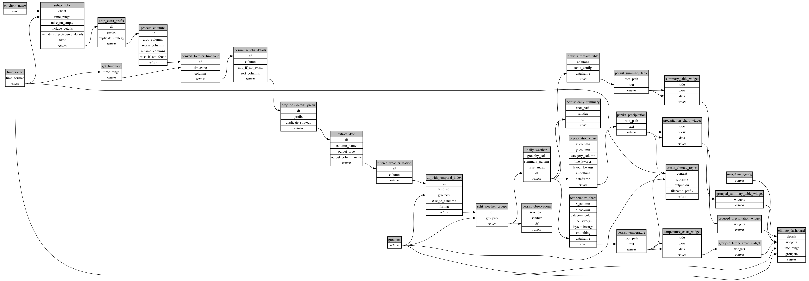

```
# AUTOGENERATED BY ECOSCOPE-WORKFLOWS; see fingerprint in README.md for details

```

```yaml
# fingerprint:
artifacts_sha256_basic: 50dd29a158d424fda6f7d1d20e09ca1e0fda4b24849ca6d9ad521560fbb0086e
artifacts_sha256_strict: e4ae3875eca011dd6814e3d8c41c0bb70a8e6aec1db5fb19be70618ddbf92a21
installed_requirements:
- channel: https://repo.prefix.dev/ecoscope-workflows/
  name: ecoscope-workflows-core
  version: {version: ==0.22.14}
- channel: https://repo.prefix.dev/ecoscope-workflows/
  name: ecoscope-workflows-ext-ecoscope
  version: {version: ==0.22.17}
- channel: https://repo.prefix.dev/ecoscope-workflows-custom/
  name: ecoscope-workflows-ext-custom
  version: {version: ==0.0.41}
params_sha256: 49bc3c8b7e835679ced69cfca65a0ad920fa8a1b5044f74c5ed952bcfc7fa837
spec_sha256: f0c73045eb8312e5ebe7958d5eba8da0f191ec38d157e16c18fb92c8be4df4e4

```

# ecoscope-workflows-tahmo-wx-workflow


